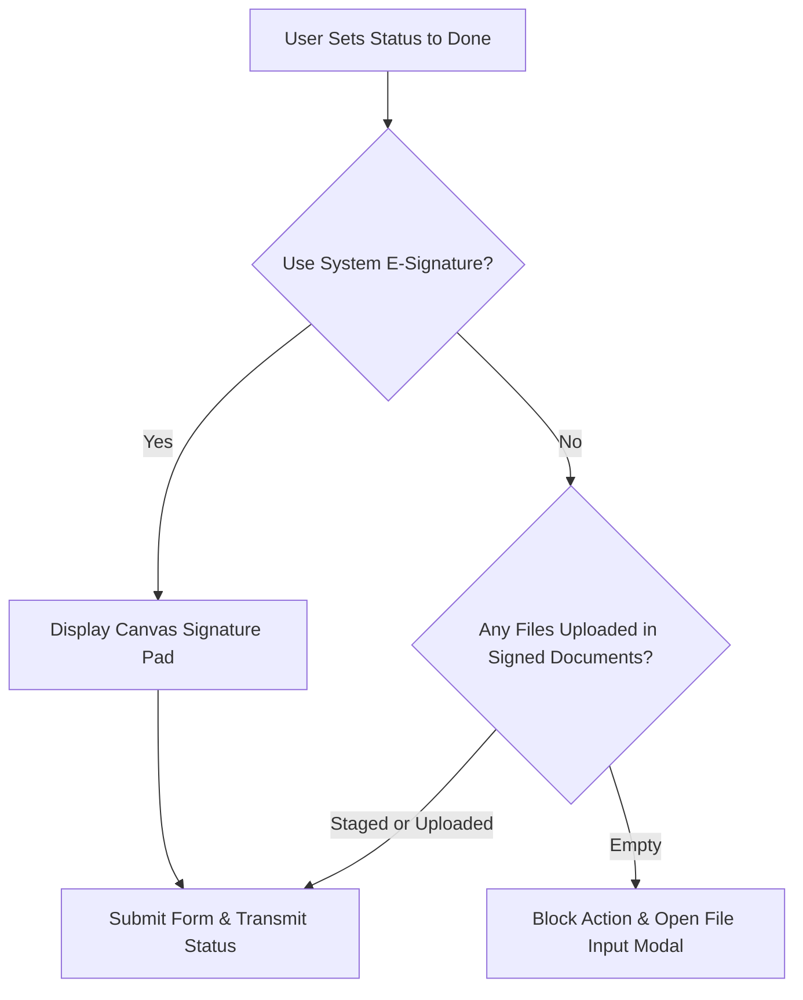

# 💧 CASP Device - Maintenance & Management System

> **A premium, high-performance, and high-contrast enterprise platform for managing industrial device life cycles and maintenance logs.**

[](https://developer.mozilla.org/en-US/docs/Web/JavaScript)
[](https://firebase.google.com/)
[](style.css)
[](#mobile--responsive-layouts)

---

## 📋 Table of Contents
1. [Overview](#-overview)
2. [Key Architecture & Features](#-key-architecture--features)
3. [Design System & Aesthetics](#-design-system--aesthetics)
4. [E-Signature & Compliance Rules](#-e-signature--compliance-rules)
5. [Database Schema (Firestore)](#-database-schema-firestore)
6. [Local Development & Setup](#-local-development--setup)
7. [Deployment Guide](#-deployment-guide)

---

## 📋 Overview

The **CASP Device - Maintenance & Management System** is a mission-critical platform engineered for field technicians, operations managers, and administrators. The system streamlines tracking of industrial machinery, schedules preventive maintenance (PM), validates field operations, and hosts a robust audit trail. 

Built with pure vanilla web tech (JS/HTML/CSS) combined with Firebase, it delivers sub-millisecond data reactivity, rich interactive grids, calendar interfaces, and responsive workflows.

---

## ✨ Key Architecture & Features

### 1. Device Catalog & Inventory
* **Thai Address Auto-Complete**: Integrates a client-side localized search utilizing `thai_address_data` to automatically resolve provinces, districts, and postal codes.
* **Warranty Tracking**: Visual indicator tags for insurance status (Active vs Expired) based on server-time comparisons.
* **Dynamic Search & Filtering**: Multi-column client-side search indexing that responds instantly as you type.

### 2. Maintenance Logging & Scheduler
* **Infinite Scroll Grid**: Custom high-performance data loader that dynamically renders cards as the user scrolls, avoiding DOM performance bottlenecks.
* **Dual View Mode**: Toggle seamlessly between a dynamic **Detail List View** (with sticky chronological headers) and a comprehensive **Calendar View** for project timelines.
* **Live Cost Calculation**: Dynamic costing engines summarize financial totals automatically as filter metrics shift.

### 3. Session & Security Systems
* **Session Protection**: Automatic inactivity tracker that logs users out after **30 minutes of idle time**, showing a clean dialog notification before redirecting.
* **LINE Integration**: Supports seamless LINE Login and single-sign-on (SSO) using the LINE Internal Browser, instantly binding profiles with Firebase users.

### 4. Safety-Net & Auditing
* **Terminal-style Audit Trail**: Tracks all CRUD actions performed by users, generating exact state comparisons (Diffs) of modified attributes.
* **Recycle Bin (Soft-Delete)**: Safeguards accidental deletions by moving files and records to `deleted_items` where admins can audit or instantly restore them.
* **25MB Enterprise File Limits**: Allows rich media attachments, schematics, and invoices up to 25MB per file.

---

## 🖤 Design System & Aesthetics

The application adheres strictly to a **High-Contrast Monochrome Design Language** (Black, White, and Muted Greys) to deliver a highly legible, premium, and clean user interface. 

### Core Theme Tokens
```css
:root {
    --primary-color: #111111;       /* Deep High-Contrast Black */
    --secondary-color: #ffffff;     /* Pure White */
    --text-color: #111111;          /* High-legibility text */
    --text-muted: #6b7280;          /* Subtle Gray for secondary info */
    --border-color: #e5e7eb;        /* Soft borders */
    --radius-md: 8px;               /* Standard button and input rounding */
    --radius-lg: 12px;              /* Card panel rounding */
}
```

### Visual Features
* **Hover Micro-Animations**: Buttons transition with clean micro-lifts (`translateY(-1px)`) and swap backgrounds/borders dynamically.
* **Monochrome Buttons**: 
  * `.btn-primary`: Pure white background, bold black border. Inverts to filled black on hover.
  * `.btn-secondary`: Thin light grey border, muted text. Deepens border/text color on hover.
* **Responsive Layouts**: On mobile displays, native filters slide out via a toggle header, and action rows shift to optimized circular Floating Action Buttons (FABs) positioned out of active touch zones.

---

## 🔒 E-Signature & Compliance Rules

To maintain high data integrity, the system implements **strict multi-level status validation** for cases transitioning to **Done (เสร็จสิ้น)**:



### Implementation Details:
1. **Form Validation**: If a technician changes a case status to **เสร็จสิ้น (Done)** and unchecks **ใช้ลายเซ็นจากระบบ (Use System E-Signature)**, saving is blocked until a physical signed document is uploaded.
2. **Timeline Validation**: If a status dot is clicked on the timeline to mark it complete, the system verifies `useESignature` and document attachments. If empty, the transaction is rejected, a warning toast is fired, and the edit modal automatically focuses the document uploader.

---

## 🗄️ Database Schema (Firestore)

The Firestore backend uses a flattened NoSQL architecture for maximum speed and indexing optimization:

| Collection | Description | Primary Fields |
| :--- | :--- | :--- |
| `users` | User credentials and RBAC | `uid`, `displayName`, `role`, `lineUserId`, `photoURL` |
| `sites` | Physical installation locations | `name`, `province`, `amphoe`, `contractType`, `insuranceEndDate` |
| `logs` | Chronicled maintenance records | `siteId`, `category`, `cost`, `timestamp`, `useESignature`, `signedDocAttachments` |
| `action_logs` | Audit trail with full object diffs | `performerId`, `actionType`, `timestamp`, `metadata`, `diff` |
| `deleted_items` | Soft-deleted storage logs | `originalCollection`, `originalId`, `deletedAt`, `deletedBy`, `data` |

---

## 🚀 Local Development & Setup

### Prerequisites
* **Node.js** (v18+ recommended)
* A modern web browser supporting ES6 modules

### Setup Steps

1. **Clone & Enter Project**:
   ```bash
   git clone https://github.com/natthakan-mac/bioinnotech-ma.git
   cd bioinnotech-ma
   ```

2. **Configure Firebase**:
   Open `app.js` and input your development project configurations:
   ```javascript
   const firebaseConfig = {
       apiKey: "AIzaSy...",
       authDomain: "bioinnotech-ma.firebaseapp.com",
       projectId: "bioinnotech-ma",
       storageBucket: "bioinnotech-ma.appspot.com",
       messagingSenderId: "123456789",
       appId: "1:1234..."
   };
   ```

3. **Start Local Server**:
   Launch the project using a simple static file server. For example, using Python or local Node tools:
   ```bash
   # Python 3
   python -m http.server 8000
   
   # Node.js (via serve)
   npx serve .
   ```
   Open your browser and navigate to `http://localhost:8000`.

---

## 📦 Deployment Guide

To deploy the application live, refer to the exhaustive [DEPLOYMENT_GUIDE.md](file:///c:/Users/salmonasaservice/Desktop/bioinnotech-ma/DEPLOYMENT_GUIDE.md) located in the repository root.

### Quick Deploy commands:
Ensure the Firebase CLI is installed and configured, then run:
```bash
# Authenticate
firebase login

# Deploy all Hosting, Firestore Rules, and Functions
firebase deploy
```

จ้ะจิงจาา

---
*© 2026 BIO Thailand Group. All rights reserved. Proprietary software developed by BIO Innotech Co., Ltd.*
